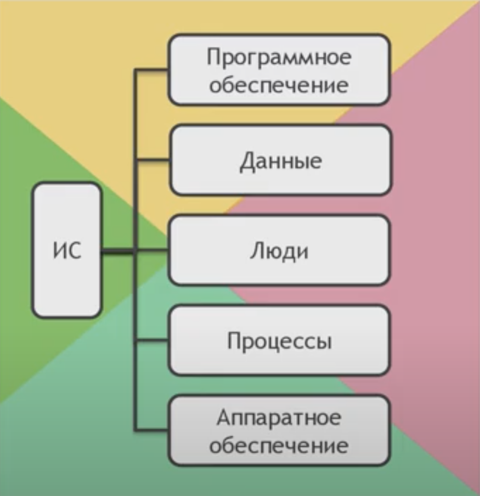
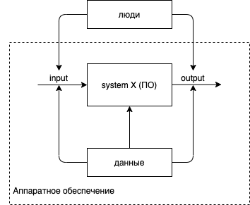
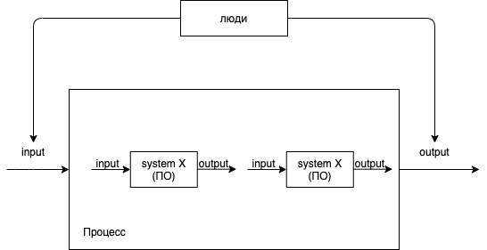
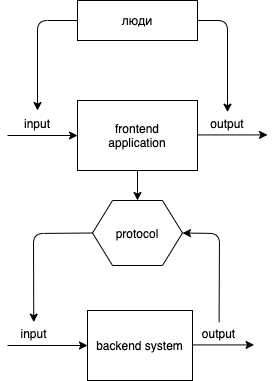

# «Построение осмысленной архитектуры веб-приложения»

Калагин Иван, VK Pay (Mail.ru)

---

# Цели курса

- научиться более осознанно подходить к решениям типовых задач
- рассмотреть как проектирование выигрывает время при разработке
- разобраться с атрибутами качества системы
- научиться разрабатывать поддерживаемые решения

---

# Архитектура

«Цель архитектуры программного обеспечения — уменьшить человеческие трудозатраты на создание и сопровождение системы».

Uncle Bob

---

# ...или

Создание ПО - это борьба со сложностью.

---

### Архитектура должна обеспечивать:

- Разнообразие вариантов использования и эффективную работу системы.
- Простоту сопровождения системы.
- Простоту разработки системы.
- Простоту развертывания системы.

Отрывок из книги: Мартин Р. «Чистая архитектура. Искусство разработки программного обеспечения».

---

### Осмысленность архитектуры - это то, что:

- позволяет не запороть архитектуру
- позволяет более качественно решить проблему
- повышает простоту разработки и сопровождения

---

# План курса

**Разработаем поэтапно реплику Excel.**
Начнем с консольного варианта и закончим web-приложением (front + back)

---

# Почему именно Excel?

1. решается множество базовых задач по программированию (структуры, ООП, дизайн кода)
2. есть множество моментов, где можно рассмотреть архитектуру
3. неплохо подходит под fullstack-проект

---

# С чего начнем

1. с понятия "информационная система"
2. i/o
3. разновидностей систем

---

# ИС - информационная система



---

# Все, чем все мы занимаемся:


---

# В рамках ИС



---

# Процесс - составная ИС



---

# i/o:


input - что поступает на вход в систему
outpu - что система выводит

---

# i/o

**Разговор о том, что будет обрабатывать i/o - примерно второй вопрос при работе с требованиями у бизнеса и первый у архитекторов и разработчиков**

---

# i/o и бизнес

- что пользователь видит при работе с ИС
- как пользователь взаимодействует с ИС
- что пользователь может ввести в ИС

---

# i/o и архитектура

- среда исполнения субъекта c i/o
- способ и формат ввода в систему
- способ и формат вывода системы

---

# i/o у консольного приложения

### Среда исполнения:

операционная система, виртуальный контейнер

### Ввод:

1. аргументы
2. консольный ввод
3. файлы, потоки, ресурсы

### Вывод:

вывод в консоль, файл, эффект

---

# i/o у фронтенда (веб)

### Среда исполнения:

браузер

### Ввод:

1. UI-render (html + css, pdf and other)
2. URL, webhooks, QR + URL

### Вывод:

1. UI-render
2. push-events
3. эффекты и передача управления бэкэнду

---

# i/o у бэкэнда

### Среда исполнения:

операционная система, виртуальный контейнер

### Ввод:

1. консольные способы ввода
2. протоколы (http, sockets)

### Вывод:

1. консольные способы вывода
2. протоколы (http, sockets)
3. эффекты и передача управления подсистемам

---

# => отличия frontend и backend

1. среда исполнения
2. способы i/o
3. назначение\*

---

# frontend + backend



---

# Важность обработки i/o


1. структуры данных и обработка
2. валидация данных
3. обработка состояния
4. i/o - первый способ протестировать ИС

---

# i/o в разработке

```js
function showMessage(from, message) {
  console.log(from + ": " + message);
}
```

**input:** args
**output:** browser console
**tests:** unit test

---

# i/o в разработке

```js
class MessageSender {
  constructor(sender) {
    this.sender = sender;
  }

  send(message) {
    this.sender.send(message);
  }
}

const messageSender = new MessageSender(new EmailSender());
messageSender.send("hello");
```

**input:** args
**output:** hidden (some state)
**tests:** unit test + mock

---

# Задачи курса:

1. научиться работать с потоком выполнения программы и данными (парадигмы: ООП, ФП; структуры)
2. разработать типичные механизмы для более эффективного решения задачи
3. разобраться в абстракциях, помогающие моделированию ПО и способу управления потоком выполнения
4. научиться обеспечивать надежность и правильность работоспособности приложения (проектирование и QA)

---

# Стек

1. Node.js (JS/Typescript) на стороне сервера/консольного приложения
2. JS/Typescript + <some_hype_web_technologies>

---

# Особенности

1. стремимся к качественному и простому коду
2. продумываем всевозможные ситуации при проектировании и разработке
3. связываем требования и конечную реализацию проекта, подкрепляя результатами тестов

---

# Первое практическое упражнение

Каркас для консольного приложения Excel (Node.js)
