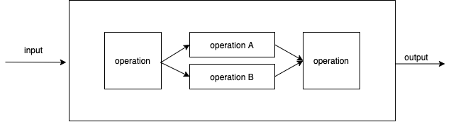
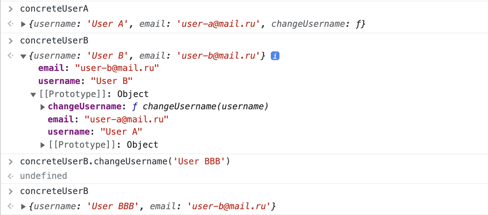

# «Управление потоком выполнения»

Курс: Построение осмысленной архитектуры веб-приложения

---

# Поток выполнения

Некоторое множество программных операторов вызванных при работе выполнении программы

**не путать с многопоточным программированием!**

---

# Поток выполнения



---

# Парадигмы - способ управления потоком выполнения

1. Структурное программирование
2. Объектно-ориентированное программирование
3. Функциональное программирования

---

# Результат работы потока выполнения

1. Вычисление операций
2. Преобразование данных

---

# Рассмотрим управлением потоком на примере задачи

_Напишите программу, которая выводит на экран числа от 1 до 100. При этом вместо чисел, кратных трем, программа должна выводить слово «Fizz», а вместо чисел, кратных пяти — слово «Buzz». Если число кратно и 3, и 5, то программа должна выводить слово «FizzBuzz»_

---

# FizzBuzz (СП)

```js
// передача управления оператору if
// так же можно переписать на switch

const args = process.argv;
const number = parseInt(process.argv[2]);

if (number % 3 === 0 && number % 5 === 0) {
  console.log("FizzBuzz");
} else if (number % 3 === 0) {
  console.log("Fizz");
} else if (number % 5 === 0) {
  console.log("Buzz");
}
```

---

# Структурное программирование

- накладывает ограничение на **прямую передачу управления**
- ограничения реализуются путем применения операторов языка (if/switch/for/break etc..)
- используются подпрограммы

---

# Цели структурного программирования

- понижение сложности кода
- улучшение структуры
- повышение трудоспособности разработчиков

---

# Принципы

1. Следует отказаться от использования оператора безусловного перехода goto.
2. Любая программа строится из трёх базовых управляющих конструкций: последовательность, ветвление, цикл.
3. В программе базовые управляющие конструкции могут быть вложены друг в друга произвольным образом.
4. Повторяющиеся фрагменты программы можно оформить в виде подпрограмм (процедур и функций)
5. Каждую логически законченную группу инструкций следует оформить как блок.
6. Все перечисленные конструкции должны иметь один вход и один выход.
7. Разработка программы ведётся пошагово, методом «сверху вниз»

---

# Теорема Бёма — Якопини

Любая программа, заданная в виде блок-схемы, может быть представлена с помощью трёх управляющих структур:

1. последовательность — обозначается: `f THEN g`
2. ветвление — обозначается: `IF p THEN f ELSE g`
3. цикл — обозначается: `WHILE p DO f`
   где **f, g** — блок-схемы с одним входом и одним выходом,
   _р_ — условие,
   **THEN, IF, ELSE, WHILE, DO** — ключевые слова.

---

# Теорема Бёма — Якопини (FizzBuzz)

Любая программа, заданная в виде блок-схемы, может быть представлена с помощью трёх управляющих структур:

```
READ(n)

IF n % 3 === 0 && n % 5 === 0 THEN WRITE "FizzBuzz"
ELSE IF n % 3 === 0 THEN WRITE "Fizz"
ELSE IF n % 5 === 0 THEN WRITE "Buzz"
```

---

# Функциональная декомпозиция

"Решение большой задачи можно разложить на ряд функций верхнего уровня. Каждую из этих функций в свою очередь можно разложить на ряд функций более низкого уровня, и так до бесконечности. Кроме того, каждую из таких функций можно представить с применением ограниченного набора управляющих структур, предлагаемых парадигмой структурного программирования."

_Мартин Р. “Чистая архитектура. Искусство разработки программного обеспечения”._

---

# Функциональная декомпозиция

- улучшение читабельности кода
- проще убеждаться в правильности работоспособности частей кода

---

# FizzBuzz (ООП) - вариант 1

```js
// вычисляющий метод с внутренней переменной состояния

const args = process.argv;
const number = parseInt(process.argv[2]);

class FizzBuzz {
  constructor(number) {
    this.number = number; // состояние (!)
  }

  solve() {
    if (this.number % 3 === 0 && this.number % 5 === 0) {
      return "FizzBuzz";
    } else if (this.number % 3 === 0) {
      return "Fizz";
    } else if (this.number % 5 === 0) {
      return "Buzz";
    }
  }
}

const fizzBuzz = new FizzBuzz(number);
console.log(fizzBuzz.solve());
```

---

# FizzBuzz (ООП) - вариант 2

```js
// статический метод

const args = process.argv;
const number = parseInt(process.argv[2]);

class FizzBuzz {
  static solve(number) {
    if (number % 3 === 0 && number % 5 === 0) {
      return "FizzBuzz";
    } else if (number % 3 === 0) {
      return "Fizz";
    } else if (number % 5 === 0) {
      return "Buzz";
    }
  }
}

console.log(FizzBuzz.solve(number));
```

---

# Объектно-ориентированное програмиирование

- накладывает ограничение на **косвенную передачу управления**
- контроль над зависимостями, путем выделения абстракций (инкапсуляция, наследование, композиция, полиморфизм)
- моделирование предметной области

---

# Инкапсуляция

**группировка состояния и поведения в рамках одной сущности**

---

# Инкапсуляция в ООП

```js
class User {
  // реализация (!)
  constructor(name, email) {
    this.username = name;
    this.email = email;
  }

  changeUsername(username) {
    this.username = username;
  }
}
```

- класс группирует идентификаторы состояния и методы для работы с классом
- класс замыкает область видимости идентификаторов и методов
- методы класса - для внешнего мира, контекст (this) - для работы внутри класса

---

# Инкапсуляция и прототипное программирование

```js
const concreteUser = {
  username: "User",
  email: "user@mail.ru",
  changeUsername(username) {
    this.username = username;
  },
};
```

- объект сразу создается в памяти (его не надо конструировать через `constructor`)
- объект так же имеет свой контекст (this) и методы/данные

---

# FizzBuzz (ООП) - вариант 1

```js
// класс FizzBuzz - абстрактный тип, может быть зависимостью
class FizzBuzz {
  constructor(number) {
    // вводится внутреннее представление данных
    this.number = number;
  }

  // косвенная передача управления
  solve() {
    if (this.number % 3 === 0 && this.number % 5 === 0) {
      return "FizzBuzz";
    } else if (this.number % 3 === 0) {
      return "Fizz";
    } else if (this.number % 5 === 0) {
      return "Buzz";
    }
  }
}
```

---

# Моделирование предметной области

- если требования сообщают что мы пишем игру - то именование сущностей могут содержать уточнение (FizzBuzz -> FizzBuzzGame)
- предметная область может содержать описание **состояния** и методов работы с ним

---

# Абстракция как зависимость

```js
class GameWithNumber {
  constructor(fizzBuzzGame, diceGame) {
    this.fizzBuzzGame = fizzBuzzGame; // композиция
    this.diceGame = diceGame;
    this.activeGame = null;
  }

  chooseGame(gameName) {
    this.activeGame = gameName;
  }

  play(number) {
    if (this.activeGame === "FizzBuzz") this.fizzBuzzGame.solve(number);
    else if (this.activeGame === "Dice") this.diceGame.didIGuess(number);
  }
}

const game = new GameWithNumber(new FizzBuzzGame(), new DiceGame());
game.chooseGame("FizzBuzz");
game.play("1"); // FizzBuzzGame выведет результат в output
game.chooseGame("Dice");
game.play(); // DiceGame выведет результат в output
```

---

# Композиция

**тип отношений при котором один объект может принадлежать только другому объекту и никому другому. При композиции образуется сильная связь между объектами.**

---

# Композиция в ООП

```js
class User {
  // реализация (!)
  constructor(name, email) {
    this.username = name;
    this.email = email;
  }

  changeUsername(username) {
    this.username = username;
  }
}

class UserProfile {
  constructor(user) {
    this.user = name;
    this.settings = new Settings();
  }
}

const user = new User("User", "user@mail.ru");
const userProfile = new UserProfile(user);
```

---

# Композиция в прототипном программировании

```js
// композиция методов объекта

// функционал работы с DOM
$(".run").click(function () {
  console.log("run");
});

// функционал ajax-запросов
$.get("/index.php", { text: "Текст" }, function (data) {
  alert(data);
});
```

---

# Пример прототипной композиции

```js
const myJqueryKillerLib = {
  ajax: (url, options) => fetch(url, options),
  getBySelector: (selectir) => document.querySelector(selector),
};
```

---

# GameWithNumber, FizzBuzzGame, DiceGame

- `GameWithNumber, FizzBuzzGame, DiceGame` - **инкапсулируют** поведение и данные
- `GameWithNumber` - верхний уровень и **композирует** нижний уровень, состоящий из `FizzBuzzGame, DiceGame`
- `class GameWithNumber` - точка входа и начала косвенной передачи управления
- `class FizzBuzzGame, DiceGame` - конечные сценарии вычисления результата

---

# GameWithNumber, FizzBuzzGame, DiceGame

- `class GameWithNumber` - точка входа и начала косвенной передачи управления
- `class FizzBuzzGame, DiceGame` - конечные сценарии вычисления результата

---

# Наследование

**отношение между объектами, при котором один объект наследует состояние и поведение от другого**

---

```js
class FizzBuzzWithTutorial extends FizzBuzz {
  constructor(number) {
    super(number);
    this.welcome();
  }

  welcome() {
    console.log(
      "This is FizzBuzz game, you can call FizzBuzzWithTutorial.solve() for start"
    );
  }

  setNumber(number) {
    this.number = number;
  }

  help() {
    console.log(
      "You can set number by setNumber method and call solve() again"
    );
  }
}

const fizzBuzz = new FizzBuzzWithTutorial(3);
// покажет welcome сообщение
fizzBuzz.solve(); // метод базового класса доступен
fizzBuzz.help();
fizzBuzz.setNumber(15);
fizzBuzz.solve();
```

---

# Прототипное наследование

```js
const concreteUserA = {
  username: "User A",
  email: "user-a@mail.ru",
  changeUsername(username) {
    this.username = username;
  },
};

const concreteUserB = {
  username: "User B",
  email: "user-b@mail.ru",
};

// ссылаемся на родительский объект-прототип
concreteUserB.__proto__ = concreteUserA;
```

---

# Прототипное наследование



---

# Прототипное наследование и FizzBuzz

имплементация кастомного метода типа Number

```js
Number.prototype.checkFizzBuzz = function () {
  const number = this;
  if (number % 3 === 0 && number % 5 === 0) {
    return "FizzBuzz";
  } else if (number % 3 === 0) {
    return "Fizz";
  } else if (number % 5 === 0) {
    return "Buzz";
  }
};

var n = 15;
n.checkFizzBuzz(); // 'FizzBuzz'
n = 3;
n.checkFizzBuzz(); // 'Fizz'
```

---

# Объектно-ориентированное програмиирование

- накладывает ограничение на **косвенную передачу управления**
- контроль над зависимостями, путем выделения абстракций (инкапсуляция, наследование, композиция, полиморфизм)
- моделирование предметной области

---

# Функциональное програмиирование

- накладывает ограничение на **изменяемость данных**
- предлагает разбиение программы на независимые "чистые" функции, с помощью которых можно скомпозировать целевой функционал
- "меньше структур данных, больше действий"

---

# FizzBuzz (ФП) - вариант 1

```js
// маппинг предикатов

const _ = require("lodash");
const args = process.argv;
const number = parseInt(process.argv[2]);

function isFizz(number) {
  return number % 3 === 0;
}

function isBuzz(number) {
  return number % 5 === 0;
}

function isFizzBuzz(number) {
  return isFizz(number) && isBuzz(number);
}

// _.cond возвращает функцию а не результат
const fizzBuzz = _.cond([
  [isFizzBuzz, _.constant("FizzBuzz")],
  [isFizz, _.constant("Fizz")],
  [isBuzz, _.constant("Buzz")],
]);

console.log(fizzBuzz(number));
```

---

## \_.cond

Создает функцию, которая выполняет итерацию по парам и вызывает соответствующую функцию первого предиката, чтобы вернуть истину.

## \_.constant

Создает функцию, возвращающую значение.

```js
// тоже самое что и
const constant = (value) => () => value;
```

---

# FizzBuzz (ФП) - вариант 2

```js
// предикаты + конкатенация строк

const args = process.argv;
const number = parseInt(process.argv[2]);

const isFizz = (number) => number % 3 === 0;
const isBuzz = (number) => number % 5 === 0;

const fizzBuzz = (number) =>
  `${isFizz(number) ? "Fizz" : ""}${isBuzz(number) ? "Buzz" : ""}`;

console.log(fizzBuzz(number));
```

---

# Функциональное програмиирование

- удобно для цепочного преобразования данных
- чистые функции легко тестировать
- можно осуществлять не только для преобразование данных, но и для построения декларативного управления вызовами

---

# Пример (императивный подход)

```js
var enrollment = [
  { enrolled: 2, grade: 100 },
  { enrolled: 2, grade: 80 },
  { enrolled: 1, grade: 89 },
];
var totalGrades = 0;
var totalStudentsFound = 0;

for (let i = 0; i < enrollment.length; i++) {
  let student = enrollment[i];
  if (student !== null) {
    if (student.enrolled > 1) {
      totalGrades += student.grade;
      totalStudentsFound++;
    }
  }
}

var average = totalGrades / totalStudentsFound; //-> 90
```

---

# Сравнение императивного подхода и функционального

```js
var enrollment = [
  { enrolled: 2, grade: 100 },
  { enrolled: 2, grade: 80 },
  { enrolled: 1, grade: 89 },
];

_.chain(enrollment)
  .filter((student) => student.enrolled > 1)
  .pluck("grade")
  .average()
  .value(); //-> 90
```

---

# Заключение

- **структурная парадигма** накладывает ограничение на **прямую передачу управления**
- **объектно-ориентированная парадигма** накладывает ограничение на **косвенную передачу управления**
- **функциональная парадигма** накладывает ограничение на **изменяемость данных**

---

# Как быть, что выбрать, что делать?

- от структурного подхода и ООП никуда не деться, если только вы не пишите на haskell/lisp итд.
- ООП или некоторые его части можно эффективно использовать для поддерживаемой и качественной архитектуры
- ФП даже в стандарте js минимизирует код в местах обработки данных (map, reduce, find ..etc..), так же есть полезные вещи в lodash/ramda

**чаще всего при разработке парадигмы комбинируются**
