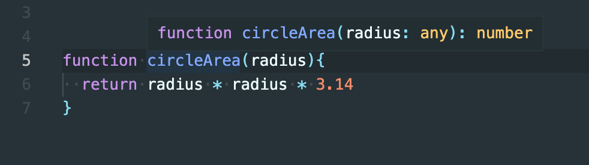
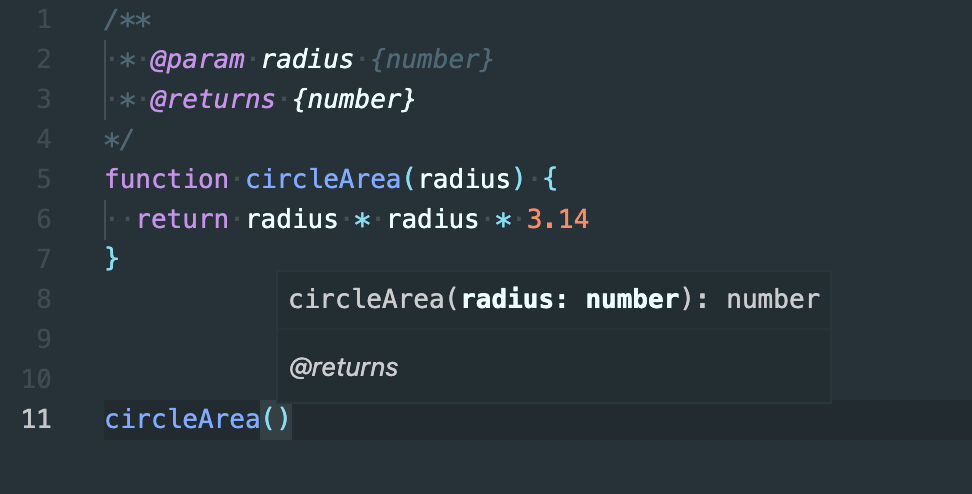
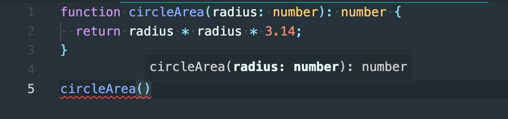

# «Обработка ошибок и исключений»

Курс: Построение осмысленной архитектуры веб-приложения

---

# Важно

## ошибка != исключение

но, ошибка может следовать из за необработанного исключения

---

# Точки появления ошибок

- обработка входных данных
- обработка вывода данных
- вычисляющий код
- необработанные исключительные ситуации
- доступность ресурса (указателя, файла, памяти и др.)

---

# Подходы обработки ошибок входных данных

- типизация
- валидация

---

# Какие потенциальные проблемы могут возникнуть?

```js
function circleArea(radius) {
  return radius * radius * 3.14;
}
```

---

# Редактор может вычислять типы



но не гарантированно

---

# Виды типизации

- динамическая - во время выполнения кода (runtime)
- статическая - до конечной сборки кода

---

# JS - борьба с динамической типизацией

```js
// circleArea -> Number -> Number
function circleArea(radius) {
  return radius * radius * 3.14;
}
```

---

# JSDoc - борьба с динамической типизацией

```js
/**
 * @param radius {number}
 * @returns {number}
 */
function circleArea(radius) {
  return radius * radius * 3.14;
}
```

---

# JSDoc - статическая типизация



---

# Typescript - статическая типизация

```ts
function circleArea(radius: number): number {
  return radius * radius * 3.14;
}
```

---

# Typescript



гарантирует проверку типов при разработке, но в runtime могут быть переданы аргументы другого типа

---

# Валидация (runtime)

```js
function circleArea(radius) {
  if (isNaN(radius)) {
    // какие то действия
    return 0;
  }
  return radius * radius * 3.14;
}
```

---

# Доверенный и недоверенный код

```js
/* в этой ситуации мы не доверяем функции, но 
функция более устойчива */
function circleArea(radius) {
  if (isNaN(radius)) {
    // какие то действия
    return 0;
  }
  return radius * radius * 3.14;
}

/* в некоторых случаях данная функция если и не сможет
вычеслить значение - то это нормально */
function circleArea(radius) {
  return radius * radius * 3.14;
}
```

---

# Доверенный и недоверенный код может смешиваться

```js
// код верхнего уровня обеспечивает надежность
// с кодом нижнего уровня
function calculator({ shape, action, radius, a, b }) {
  if (shape === "circle" && action === "area" && !isNan(radius)) {
    return circleArea(radius);
  } else if (shape === "square" /*  ... */) {
    // другие вычисления
  }
}

// доверенный код = проблемы с ним на плечах разработчика
function circleArea(radius) {
  return radius * radius * 3.14;
}
```

---

# Рекомендации по валидации

```js
function circleArea(radius) {
  if (isNaN(radius)) {
    return 0;
  }
  return radius * radius * 3.14;
}
```

1. удобнее в начале тела функции/метода делать проверки на ошибки
2. сложные проверки должны уезжать в утилитарный или библиотечный код
3. реакция на ошибку: возврат значения / вызов кода / событие / исключения должны проектироваться со здравым смыслом

---

# Общие рекомендации

1. статическая типизация улучшает жизнь - используйте в серьезных решениях Typescript
2. валидация действительно нужна
3. юнит-тестирование помогает удостоверится в ожидаемом поведении при ошибках

---

# Подходы обработки ошибок вывода данных

- типизация
- обеспечение корректности / устойчивости

---

# Корректность vs Устойчивость

**Корректность** предполагает что нельзя возвращать неточный результат - лучше вернуть ничего

**Устойчивость** требует сделать хоть что-то чтобы продолжить выполнения

---

# Когда и какой подход обеспечивать

**Мониторинг температуры воздуха:** приложение собирает данные каждые N секунд и если вывод датчиков по некоторым причинам
вычисляется с ошибкой можно проигнорировать вычисление и повторить в следующий момент времени (**усточивость**)

**Медицинское оборудование для операций:** если в некоторый момент времени на выводе образовалось ошибочное значение -
для дальнейшего выполнения мы не имеем права устойчиво продолжать операцию. (**корректность**)

---

# Когда и какой подход обеспечивать

**UI профиля в соц. сети:** по каким то причинам некоторые данные пользователя не загрузились для отображения - в данной ситуации
мы можем "зависнуть" в прелоадере или показать кнопку попробовать еще раз или вывести запасной UI (**усточивость**)

**Платежная операция:** если средства не удалось списать с карты - то мы считаем что имеет смысл завершить операцию, так как обработка
этих данных может быть чревата последствиями (**корректность**), но так же это не исключает предоставления возможности повтора операции =>
**устойчивость**

---

# Подходы обработки ошибок вывода данных (устойчивость)

```ts
type Fio = {
  firstName: string;
  lastName: string;
  patronymic?: string;
};

function parseFIO(str: string): Fio {
  const [lastName, firstName, patronymic] = str.split(" ");
  return {
    lastName,
    firstName,
    patronymic: patronymic || undefined,
  };
}

const { firstName, lastName, patronymic } = parseFIO("Ivanov Ivan");
console.log("Hello", firstName, lastName, patronymic || "", "!");
```

---

# Подходы обработки ошибок вывода данных (корректность)

```ts
const productBasket = new Basket(...products...);

// если скидка имеется, но getDiscount() не вычислил данные
// мы не можем продолжать покупку, так как применение скидки обязательно

console.log("Final price:", productBasket.getPrice(), "Discount:", productBasket.getDiscount());
```

---

# Подходы обработки ошибок вычисляющего кода

- типизация
- обеспечение корректности / устойчивости
- обработка исключений

---

# Подходы обработки доступности ресурса

- обеспечение корректности / устойчивости
- обработка исключений

---

# Общие варианты обработки ошибок

1. Возврат нейтрального значения
2. Возврат следующего корректного блока данных
3. Возврат предыдущего результата
4. Возврат близжашего допустимого значения
5. Передать вызов глобальному обработчику ошибок
6. Локализаци ошибки и вывод сообщения
7. Прекратить выполнение

---

# Исключения

### специальное средство, позволяющее передать в вызывающий код возникшие ошибки или исключительные ситуации.

---

# Пример выброса исключения

```js
function foo() {
  throw new Error("Foo error");
}
```

---

# Пример обработки исключения

```js
function foo() {
  throw new Error("Foo error");
}

try {
  foo();
} catch (e) {
  // e содержит объект
  console.log(e);
}
```

---

# Исключения и ЯП

В разных языках исключения ведут себя по разному.

- В C++ неперхваченные исключения могут привести к std::terminate() и вызову abort
- В Java "проверяемое исключение" прекращает работу потока, исключение "периода выполнения" может быть проигнорировано
- Visual Basic завершит работу если исключение не обработано
- JS прерывает выполнение в случае необработанного исключения, но не прервет асинхронные операции которые запущенны до выброса исключения

---

# Стратегия работы с исключениями

1. Используйте исключения для оповещения других частей программы об ошибках, которые нельзя игнорировать
2. Не выбрасывайте исключения по мелочам
3. Используйте правильный уровень абстракции для выброса исключений

---

# Пример выброса исключения

```js
class Calculator {
  constructor(a, b) {
    this.a = a;
    this.b = b;
  }

  div() {
    if (this.b === 0) {
      throw new Error("Division by zero");
    }
    return this.a / this.b;
  }
}
```

---

# Выброс исключения по мелочам

```js
function circleArea(radius) {
  if (isNaN(radius)) {
    throw new Error("Radius is not valid");
  }
  return radius * radius * 3.14;
}
```

---

# Если бы исключения использовались по мелочам

```js
document.getElementById('.ddd'); // null

// иначе бы пришлось
try {
  document.getElementById('.ddd'); // null
} catch () {
  console.log('something wrong...');
}
```

---

# Исключения в конструкторе

если созданный объект без обязательных параметров или зависимостей не может существовать - то при создании объекта
можно выбросить исключение.

```js
class Order {
  constructor(products) {
    if (!products) {
      throw new Error("Products not specified");
    }
  }
}

try {
  const order = new Order();
} catch (e) {
  logger(e);
}
```

---

# Исключения в методах - верный выбор абстракции

```js
class ReservationService {
  constructor(database) {
    this.db = database;
  }

  reserve(serviceId, dateTime) {
    // insert может выбросить исключение
    // в данном случае здесь можно не обрабатывать исключение - оно будет обработано по месту вызова
    this.db.insert("reservation_table", { serviceId, dateTime });
  }
}

// место в коде которое относится к блоку "Бронирование"
const reservationService = new ReservationService(new Database());

try {
  reservationService.reserve(1, "2021-12-24 08:00");
} catch (e) {
  logger(e);
}
```

---

# Сложности с поднятием исключений

```js
class ReservationService {
  constructor(database) {
    this.db = database;
  }

  reserve(serviceId, dateTime) {
    try {
      this.db.insert("reservation_table", { serviceId, dateTime });
    } catch (e) {
      // 1 - что теперь?
      // 2 - вероятно захочется поднять исключение
      throw e;
    }
  }
}

const reservationService = new ReservationService(new Database());

try {
  reservationService.reserve(1, "2021-12-24 08:00");
} catch (e) {
  logger(e);
}

// как можно заметить неверный выбранный уровень работы с исключениями раздувает код
```

---

# Стратегия работы с исключениями

1. Используйте исключения для оповещения других частей программы об ошибках, которые нельзя игнорировать
2. Не выбрасывайте исключения по мелочам
3. Используйте правильный уровень абстракции для выброса исключений

---

# Тестирование кода с исключениями

```js
describe("ReservationService", () => {
  test("Should reserve throw exception if database not connected", () => {
    const reservationService = new ReservationService(
      new DisabledDatabaseMock() // insert -> throw new Error('DB disconnected')
    );
    expect(reservationService.reserve(1, "2021-12-24 08:00")).toThrow();
  });

  test("Should reserve throw exception if date-time is not specified", () => {
    const reservationService = new ReservationService(new Database());
    expect(reservationService.reserve(1, "...")).toThrowError(
      new Error("Invalid dateTime")
    );
  });
});
```

---

# Общие рекомендации для уменьшения количества ошибок

1. Использование статической типизации
2. Валидация входных данных и соглашение о доверенности/недоверенности кода
3. Соглашение об использовании исключений - уровни абстракций, анализ необходимых ситуаций
4. Обрабатывать исключения если ваш код или сторонний может генерировать исключительные ситуации
5. Продумывать обработчики для организации устойчивого поведения
6. Проверять код тестами
