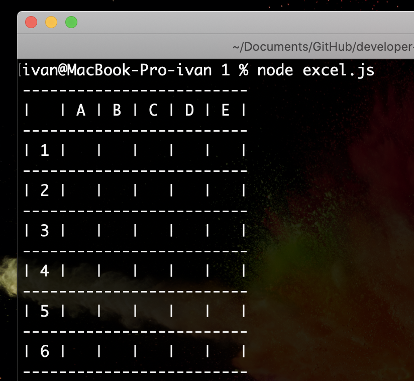

# Task 1

## Каркас для консольного приложения Excel (Node.js)

В рамках задания требуется:

1. создать новый репозиторий excel-application и опубликовать на Github
2. в репозитории создать папку excel-console с файлом excel.js
3. инициализируйте npm (package.json)
4. внутри файла excel.js реализуйте вывод таблицы с помощью console.log:
   
5. в npm-scripts (package.json) создайте команду run для запуска скрипта `node excel.js`

---

## Справочная информация:

[Работа с Git/Github](https://medium.com/nuances-of-programming/%D0%B7%D0%BD%D0%B0%D0%BA%D0%BE%D0%BC%D1%81%D1%82%D0%B2%D0%BE-%D1%81-git-%D0%B8-github-%D1%80%D1%83%D0%BA%D0%BE%D0%B2%D0%BE%D0%B4%D1%81%D1%82%D0%B2%D0%BE-%D0%B4%D0%BB%D1%8F-%D0%BD%D0%B0%D1%87%D0%B8%D0%BD%D0%B0%D1%8E%D1%89%D0%B8%D1%85-54ea2567d76c)

[Введение в Node.js](https://metanit.com/web/nodejs/1.1.php)

[Что такое npm](https://www.hostinger.ru/rukovodstva/chto-takoe-npm)

[Node.js console output](https://nodejs.dev/learn/output-to-the-command-line-using-nodejs)
